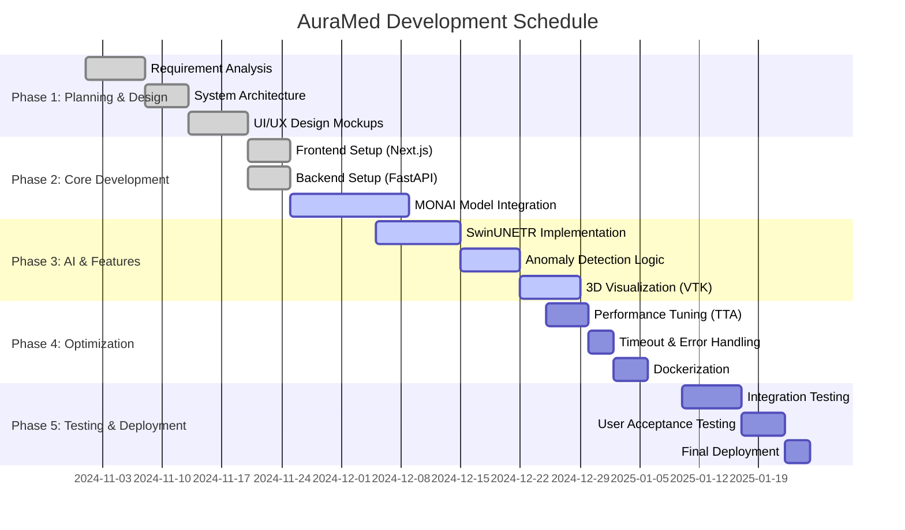

# AuraMed: Project Implementation & Schedule

## 1. Executive Summary
**AuraMed** is a next-generation AI-powered medical imaging platform designed to detect anomalies in 3D medical scans (CT/MRI) with high precision. The system leverages a hybrid architecture combining a high-performance **Next.js frontend** for 3D visualization and a robust **Python/MONAI backend** for deep learning inference.

---

## 2. Technology Stack

### Frontend (Client-Side)
*   **Framework**: [Next.js 14](https://nextjs.org/) (React Framework for Production)
*   **Language**: **TypeScript** (Static typing for reliability)
*   **Styling**: **Tailwind CSS** (Utility-first CSS) with custom design tokens.
*   **UI Library**: Custom Component Library (Shadcn/Primitive-based).
*   **State Management**: React Hooks & Context API.
*   **Visualization**: VTK.js / Custom Canvas WebGL integration for 3D rendering.
*   **Communication**: Fetch API / Axios for REST communications.

### Backend (AI Service)
*   **Framework**: [FastAPI](https://fastapi.tiangolo.com/) (High-performance web framework).
*   **Language**: **Python 3.11**
*   **Core AI Engine**: [MONAI](https://monai.io/) (Medical Open Network for AI).
*   **Deep Learning Framework**: **PyTorch 2.1.0** (with CUDA support for GPU acceleration).
*   **Data Processing**: 
    *   `Nibabel` (NIfTI file handling)
    *   `Numpy` (Tensor manipulations)
    *   `Scipy` (Post-processing & morphological operations)
*   **Concurrency**: `Asyncio` & `Uvicorn` (ASGI Server).

### DevOps & Infrastructure
*   **Runtime Environment**: Node.js (Orchestrator) spawning Python Subprocesses.
*   **Containerization**: **Docker** (Full stack containerization support).
*   **Version Control**: Git.

---

## 3. Implementation Architecture

### High-Level Design
The application follows a **Microservices-lite** pattern where the frontend acts as the orchestrator and the Python backend serves as a specialized compute engine.

1.  **Orchestration Layer (`start-dev.js`)**:
    *   A Node.js script launches both the Next.js `dev` server (Port 3000) and the Python FastAPI service (Port 8000).
    *   It manages process lifecycles and ensures clean shutdowns.

2.  **Frontend Implementation**:
    *   **User Interface**: A modern, dark-themed medical dashboard.
    *   **Upload Flow**: Users drag-and-drop NIfTI/DICOM files.
    *   **API Interaction**: The frontend sends files to `http://localhost:8000/analyze`.
    *   **Visualization**: It receives JSON results (anomalies, confidence) and VTI/Image paths to render heatmaps.

3.  **Backend Implementation (`src/services/monai/app.py`)**:
    *   **Job Queue**: Uses an internal dictionary `jobs` to track analysis status (queued -> processing -> completed).
    *   **Analysis Pipeline**:
        1.  **Ingestion**: Receives file upload -> Saves to `temp_files`.
        2.  **Preprocessing**: Resampling, Intensity Scaling (0-1), Tensor conversion.
        3.  **Inference (Deep Ensemble)**: Runs input through **SwinUNETR** or **DenseNet** models. Optimizations include 3-way TTA (Test Time Augmentation).
        4.  **Post-Processing**: Gaussian smoothing, morphological closing to remove noise.
        5.  **Reporting**: Generates clinical findings, heatmaps, and JSON response.

---

## 4. Project Planning & Schedule (Gantt Chart)

The following Gantt chart outlines the development phases, from initial planning to final deployment.

## 5. Current Status
*   **Overall Progress**: ~75% Completed.
*   **Recent Achievements**:
    *   Successfully integrated **FastAPI** with `lifespan` management.
    *   Implemented **Deep Ensemble** inference with TTA.
    *   Resolved **frontend-backend connectivity** issues (CORS/Timeout).
*   **Immediate Focus**:
    *   Finalizing 3D Visualization in the browser.
    *   End-to-end integration testing with complex datasets.
